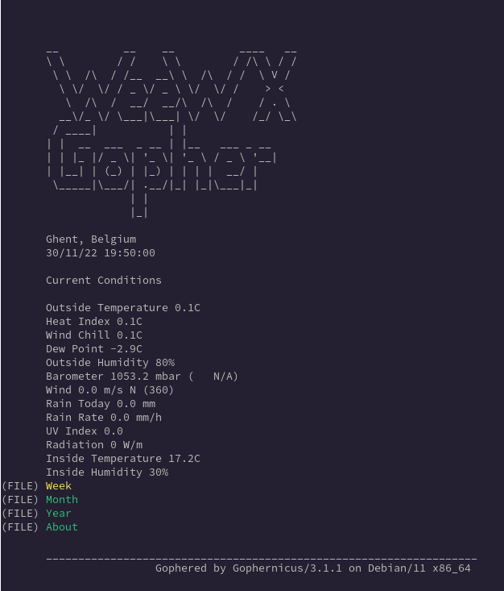

# WeeWX Gopher

A skin for WeeWX which outputs [Gopher menu items](https://en.wikipedia.org/wiki/Gopher_(protocol)#Source_code_of_a_menu) which can be served by a [Gopher server](https://github.com/gophernicus/gophernicus).



## Installation

Clone the repo and run the installer:
```
wee_extension --install weewx-gopher
```

Restart weewx:
```
sudo systemctl restart weewx
```

To serve the Gopher menu items, [Gophernicus](https://github.com/gophernicus/gophernicus) can be used.

## Usage

To access the current weather coniditions, with for example `lynx`, just issue:
```
lynx gopher://$WEEWX_INSTANCE
```
